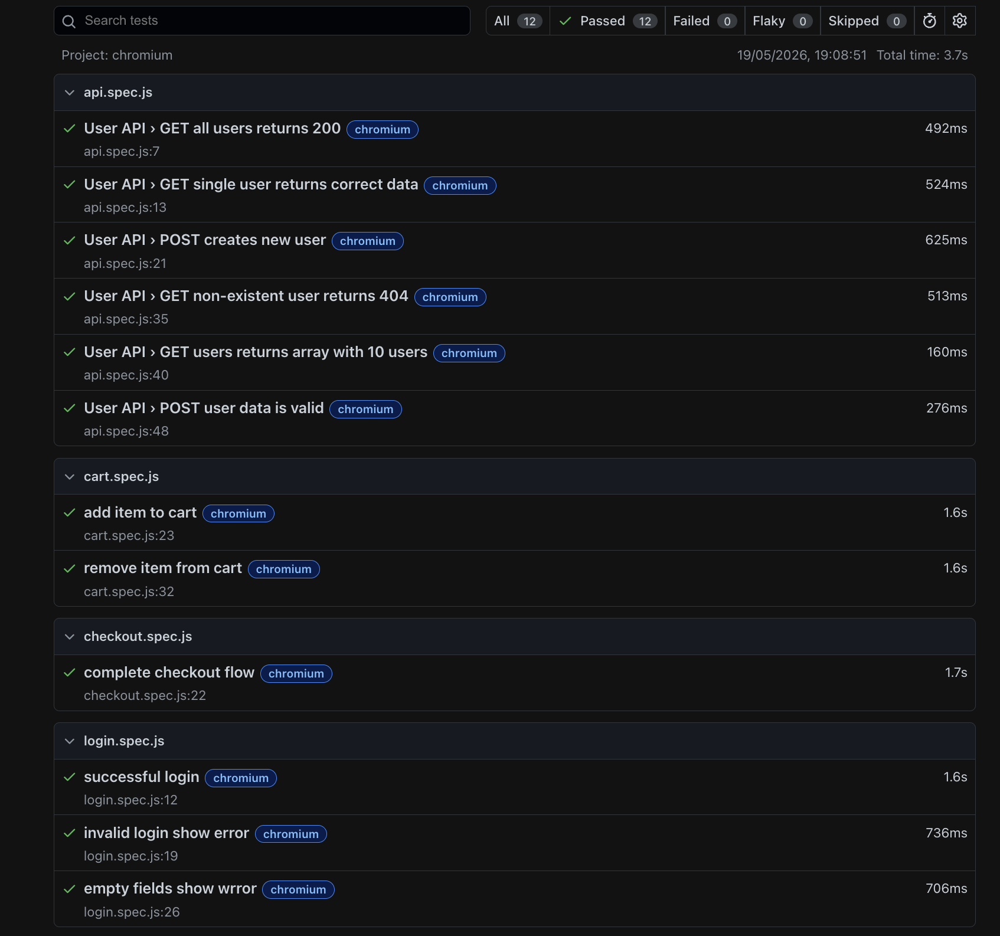

# Playwright Automation Framework

A production-grade test automation framework built with Playwright and JavaScript, implementing Page Object Model, API testing, and CI/CD integration.

## 🛠️ Tech Stack

- **Playwright** — End-to-end UI and API testing
- **JavaScript** — Core programming language
- **Page Object Model** — Framework design pattern
- **GitHub Actions** — CI/CD pipeline
- **dotenv** — Environment variable management

## 📁 Project Structure

```
playwright-automation-framework/
├── .github/workflows/     ← CI/CD pipeline
├── data/                  ← Centralized test data
├── pages/                 ← Page Object classes
├── tests/                 ← Test suites
├── test-screenshots/      ← Report screenshots
└── playwright.config.js   ← Framework configuration
```

## ⚙️ Setup

```bash
git clone git@github.com:AmanSoniQA/playwright-automation-framework.git
npm install
npx playwright install
```

## 🔐 Environment Variables

Create a `.env.production` file:

```
BASE_URL=https://www.saucedemo.com
USERNAME=standard_user
PASSWORD=secret_sauce
```

## 🚀 Running Tests

```bash
# Run all tests
npx playwright test

# Run on specific browser
npx playwright test --project=chromium

# Run specific test file
npx playwright test tests/login.spec.js

# Run with browser visible
npx playwright test --headed

# Switch environment
ENV=staging npx playwright test
```

## 📊 Test Report

```bash
npx playwright show-report
```

## 🧪 Test Suites

| Suite | Tests | Coverage |
|---|---|---|
| Login | 3 | Valid login, invalid login, empty fields |
| Cart | 2 | Add to cart, remove from cart |
| Checkout | 1 | Complete E2E purchase flow |
| API | 6 | GET, POST, negative testing |

## ✅ CI/CD

Tests run automatically on every push to main branch via GitHub Actions.


## 📸 Test Report Screenshot

